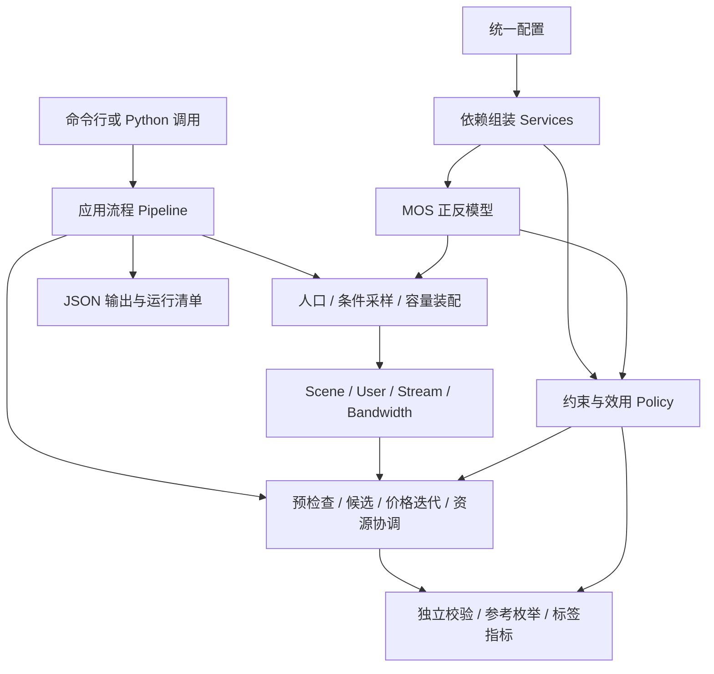

# 代码架构与配置说明（v2）

## 1. 整体架构设计

本实现以个人用户为单位；小区表示一个基站覆盖区域。每个用户只有一个当前业务，上行与下行是两个独立资源池。内部带宽统一使用 kbps，时延和缓冲使用 ms，丢包与卡顿使用 0～1 比例。默认上行、下行容量均为 120000 kbps，即各 120 Mbps。

采用分层架构和依赖注入。业务数据结构、MOS 数学模型、生成器、求解器、评估器、文件读写分别承担单一职责。替换一个模型不需要复制整个求解器；修改候选或协调策略也不必修改数据生成流程。扩展采用小接口和组合，避免依赖复杂的继承树。



`domain` 表达输入输出契约；`models` 负责公式；`optimization` 负责约束和求解；`simulation` 负责可重复的数据生成；`evaluation` 负责校验与对照；`application` 串起用例；`infrastructure` 提供配置和存储。共享配置通过构造函数传入，无全局可变求解状态。

## 2. 核心数据与计算约定

| 对象 | 职责与关键字段 |
| --- | --- |
| `Bandwidth` | 独立的 `ul`、`dl`；支持相加、相减和容量判断 |
| `Stream` | 单方向固定环境：分辨率、像素宽高、RTT、丢包、卡顿、码率上下界、启动阶段和可选缓冲 |
| `User` | 业务、套餐、位置、容忍度、profile、当前资源、方向流、观测 MOS、目标与基本保障、合同/上限/适配开关 |
| `Scene` | 容量、未管理占用、预留、用户集合、模型指纹和 schema 版本 |
| `Action` | 某用户一组上下行分配及其方向 MOS、会话 MOS、效用、保障状态 |
| `InverseResult` | 目标可达性、所需带宽、复算 MOS 和失败原因 |
| `SolveResult` | 最佳分配、证据、轨迹、停止原因、总步数与迭代轮数 |

求解期间保持非码率 KQI、分辨率和 profile 不变。媒体流码率可以在合法区间内变化；关闭 `bitrate_adaptation` 时保留当前媒体码率。游戏按固定上下行配额占用资源，其 MOS 由环境决定；不能通过加带宽改善游戏 MOS。浏览和下载满足 QoS 下限后体验饱和，可回收多余资源。

双向媒体会话采用：

$$
M_i=\min(M_i^{\mathrm{UL}},M_i^{\mathrm{DL}}).
$$

单方向业务取该方向 MOS。游戏用 `session` 环境流。用户仅计数一次。`baseline` 是基本保障门槛，`target` 是体验目标；只有 `hard_mos=true` 或 `allow_soft_degrade=false` 时，基本保障才成为不可违反的硬条件。默认允许软降级，但合同、资源容量和媒体合法范围始终是硬约束。

模型正向和反向计算共用配置中的公式系数。反推先检查最低合法码率，再检查上限可达性，执行解析反推、向上量化并复算；不可达时返回原因，不把目标强行截成“已达到”。例如固定会议环境 720 分辨率、RTT 60 ms、丢包 0.001、卡顿 0.01 下，目标 MOS 4 需要 2148 kbps，复算约 4.000344。

## 3. 数据生成模块

1. 根据种子及场景、用户、阶段生成独立随机流。人口采用最大余数法转换为整数人数，支持独立边际分布与显式联合分布。
2. 为每个用户采样业务允许的分辨率、固定网络质量状态及 KQI。共享质量状态提供简单相关性，`mixed_probability` 控制部分指标独立取档。
3. `reachable` 模式在当前合法可达范围内采样；`specified` 模式先在套餐与业务分组内分配指定 MOS 档位，再条件采样并反推码率。
4. 双向媒体随机选择首个方向作为会话瓶颈候选；另一方向至少达到其 MOS，允许上下行不同。最终档位以量化后实际会话 MOS 校验。
5. 每人保留有限状态池，使用有节点上限的回溯装配满足两个资源池的场景。剩余用户的方向最小占用作为剪枝下界；不把所有用户固定为最低带宽状态。
6. 写出输入后重新读取、复算 MOS 并检查当前分配约束。只有通过校验的数据送入求解器。

严格配额不可达时生成失败，保留场景编号、原因和拒绝统计。宽松配额在请求档位无候选时重新采样可达状态，并标注 `quota_status=gap`；目前不保证选中距离原档位最近的状态。有限采样失败与数学证明不可行分开解释，不将低接受率直接视为全域无解。

`solver_inputs.jsonl` 不包含生成时请求档位、真值评估权重等审计字段；这些额外信息只在 `scenes.jsonl` 的 `private` 中。当前是无测量噪声的匹配模型模拟，位置、容忍度直接作为可见字段，默认影响因子均为 1；不代表已完成真实网络数据校准。

## 4. 博弈求解模块

### 4.1 先判断能否保障

先验证并保存合法的当前方案，然后分别构造硬条件、基本保障和目标条件的逐用户最小资源动作。当前固定媒体、方向独立且 MOS 对码率单调的模型下，可用这些分量最小动作给出可行性证据。

$$
\sum_i b_i^{\mathrm{UL}}\le C^{\mathrm{UL}}-U^{\mathrm{UL}}-R^{\mathrm{UL}},\qquad
\sum_i b_i^{\mathrm{DL}}\le C^{\mathrm{DL}}-U^{\mathrm{DL}}-R^{\mathrm{DL}}.
$$

某用户自身无法达到门槛，或所有用户最低需求之和超出容量，分别记录个人不可达或容量缺口。这个证明的适用域是当前固定分辨率和独立方向码率区间；后续加入跨方向耦合、离散分辨率切换时必须重新设计证明方法。

全员基本保障可行时进入 `NORMAL`，候选必须满足基本保障。否则进入 `DEGRADED`，仍遵守全部硬条件，按业务优先级与套餐顺序优先减少基本保障不足人数、再减少缺口，最后改善效用。

### 4.2 构造有限候选

MOS 网格经反推生成方向码率，加入上下界、当前动作、硬条件/基本保障/目标见证动作，再组合上下行。剪枝比较资源、各方向体验、保障状态和稳定性成本，保留必要动作。原始候选数和保留候选数均有限制；发生截断时输出 `candidate_truncated=true`。MOS 等级范围逐轮扩大，当前动作与基本保障修复动作可提前使用。

### 4.3 价格、协调与最佳方案

用户候选效用形式为：

$$
e_i=\frac{M_i-1}{4},\qquad
H_i=(w_i+\eta d_i)e_i-\beta\left\lvert e_i-e_i^{\mathrm{current}}\right\rvert.
$$

其中权重由套餐、业务、位置、容忍度共同决定；历史欠账仅在 `history_mos` 存在时生效，合成单快照默认无历史。用户以如下分数作出局部选择：

$$
H_i-\frac{\lambda_{\mathrm{UL}}b_i^{\mathrm{UL}}+\lambda_{\mathrm{DL}}b_i^{\mathrm{DL}}}{b_{\mathrm{ref}}}.
$$

协调器回收非重点业务多余资源，再按 Non-GBR、GBR 阶段处理资源冲突；同阶段结合保护优先级。修复只能有效释放超载方向资源，不能以“释放下行”掩盖“上行仍超载”。有余量时升级候选，并尝试有限数量的用户对交换。正常模式比较总效用；降级模式按保障向量字典序比较，再比较效用。

价格按协调前需求更新，使超额需求仍能影响下一轮：

$$
\lambda_d^{k+1}=\max\left(0,\lambda_d^k+\frac{\gamma_0}{\sqrt{k+1}}\frac{B_{\mathrm{raw},d}^k-C_{\mathrm{available},d}}{b_{\mathrm{ref}}}\right).
$$

每轮保留最好的硬可行方案。连续稳定并通过当前有限候选及受限交换检查时标记局部收敛；检测到重复策略循环时停止并返回最佳方案。因此这是有限候选启发式协调算法，不是一般博弈的全局均衡或全局最优证明。

### 4.4 三类预算

| 参数 | 实际约束 |
| --- | --- |
| `solver.max_iterations` | 外层价格迭代轮数，默认 50 |
| `solver.max_total_steps` | 输入校验、模型计算、候选评估、比较、协调和最终校验共享工作量，默认 200000 |
| `solver.time_budget_ms` | 求解搜索的协作式时间期限，默认 2000 ms |

工作量计数是应用定义的操作计数，不是 CPU 指令数。最终校验预留每人最多 4 步加全局 1 步，不能被搜索提前花掉；因此极小预算会直接报参数错误。达到搜索时间后仍完成最终校验，整个命令还包括生成、参考计算和文件读写，其总耗时可能超过此值。没有来得及验证任何方案时返回 `NO_FEASIBLE_FOUND`。

## 5. 结果、标签和参考计算

| 文件 | 内容 |
| --- | --- |
| `manifest.json` | 完成状态、配置/模型/代码指纹、随机种子、Python 版本及输入指纹；最后才写 `complete=true` |
| `resolved_config.json` | 合并命令行覆盖后的完整参数 |
| `solver_inputs.jsonl` | 每行一个 schema 2.0 场景，可独立求解 |
| `scenes.jsonl` | 场景快照与仅供生成审计的 private 信息 |
| `source_catalog.json` | 采样范围与业务参数来源声明，注明未校准 |
| `generation_report.json` | 成功失败数量、失败原因、实际 MOS 档位、配额缺口 |
| `validation_report.json` | 生成数据写出后重读校验结果；是否完整生成单独记录 |
| `solve_results.jsonl` | 最佳个人分配、方向/会话 MOS、证据、逐轮轨迹、步数、停止原因 |
| `static_labels.jsonl` | 当前硬可行性以及求解预检查所得证据；证据可能因预算不足而不完整 |
| `run_labels.jsonl` | 当前算法结果标签、目标达标状态和证据 |
| `metrics.jsonl` | 加权 MOS 变化、改善/恶化人数、净新增达标数、资源分配、保障向量和 WGR |
| `reference_results.jsonl` | 独立候选参考枚举状态、最优值、候选空间指纹与预算 |
| `summary.json` | 场景总览、状态分布、最大轮数/工作量/求解时间和加权 MOS 增益总和 |

`generate` 只输出生成侧文件；`solve` 只输出求解侧文件及清单和完整配置；`run` 输出两者。JSONL 文件一行对应一个场景。文件采用临时文件替换写入，整个目录仍以 manifest 完成状态为准。

| 字段取值 | 含义 |
| --- | --- |
| `FEASIBLE_NORMAL` | 返回动作满足硬条件与全员基本保障 |
| `FEASIBLE_DEGRADED` | 返回动作满足硬条件，存在基本保障不足 |
| `INFEASIBLE_HARD` | 当前模型适用域内存在硬条件不可行证据 |
| `NO_FEASIBLE_FOUND` | 本次没有获得已验证方案，不等于证明无解 |
| `CONVERGED_LOCAL` | 当前保留候选与受限协调检查范围内稳定 |
| `STOPPED_CYCLE` | 发现策略循环，保留最佳方案 |
| `MAX_ITERATIONS` / `MAX_TOTAL_STEPS` / `TIME_BUDGET` | 对应预算触发停止，需结合 `solution_status` 阅读 |
| `PRECHECK` | 预检查发现硬条件冲突 |

独立参考枚举不复用求解器的剪枝和协调逻辑，但共用被测试的数学模型和约束；候选网格包含参考网格、求解网格以及算法实际动作。完整遍历才标记 `exact_discrete`，预算不足时只标记 `best_known` 或 `not_computed`。离散最优不等于连续空间最优。

参考分别记录加权会话 MOS 最优值和策略排序最优值，它们可能由不同方案达到。WGR 只在参考完整、当前基线合法且分母为正时计算：

$$
WGR=\frac{U_{\mathrm{algorithm}}-U_{\mathrm{current}}}{U_{\mathrm{reference}}-U_{\mathrm{current}}}.
$$

不满足条件时为 null 并给出原因；不把缺少参考值包装成 0，也不通过裁剪掩盖比较口径问题。算法主要优化保障顺序和 $H$，WGR 是另一项评估指标。

## 6. 每个代码文件负责什么

以下为运行代码的完整文件职责；各目录 `__init__.py` 仅标识包，根包还声明版本号，不承载算法。

| 文件 | 职责 |
| --- | --- |
| `game_solving/__main__.py` | `python -m game_solving` 入口 |
| `game_solving/domain/entities.py` | 数据对象、JSON 字典转 Scene、版本拒绝 |
| `game_solving/domain/ports.py` | 模型、候选提供器、协调器的小接口约定 |
| `game_solving/domain/validation.py` | 输入结构、单位、数值和用户字段校验 |
| `game_solving/models/mos.py` | A/B MOS、视频通话专用公式、正算与反推 |
| `game_solving/simulation/population.py` | 随机流、整数人数分配、独立/联合人口 |
| `game_solving/simulation/sampler.py` | 固定环境采样、档位条件采样、码率反推及审计 |
| `game_solving/simulation/assembler.py` | 双资源池场景装配、有限回溯与下界剪枝 |
| `game_solving/simulation/summary.py` | 生成场景的分布、MOS 与双向资源特点日志，不重新计算模型 |
| `game_solving/simulation/generator.py` | 生成编排、重试上限、失败报告与数据划分 |
| `game_solving/optimization/policy.py` | 硬条件、权重、效用、保障排序和动作评估 |
| `game_solving/optimization/history.py` | 按时间窗口和模型版本计算已有历史 MOS；由调用方传入历史结果 |
| `game_solving/optimization/budget.py` | 统一工作计数、搜索期限、终检预留 |
| `game_solving/optimization/feasibility.py` | 最低需求动作、个人不可达与容量证据 |
| `game_solving/optimization/candidates.py` | 候选反推组合、保护动作、剪枝、截断和逐轮范围 |
| `game_solving/optimization/coordinator.py` | 资源修复、余量升级、有限双用户交换 |
| `game_solving/optimization/solver.py` | 价格迭代、最佳解保存、停止判断及终检 |
| `game_solving/evaluation/validation.py` | 分配集合完整性、总容量和独立动作复算 |
| `game_solving/evaluation/reference.py` | 独立离散候选枚举参考、预算与完整性状态 |
| `game_solving/evaluation/metrics.py` | 静态事实与算法标签、人数指标、MOS 增益与 WGR |
| `game_solving/infrastructure/config.py` | 默认配置加载、覆盖合并、参数校验和指纹 |
| `game_solving/infrastructure/json_store.py` | JSON/JSONL 读写、空输出目录保护、原子文件替换 |
| `game_solving/application/services.py` | ModelRegistry 注册表与默认依赖组装 |
| `game_solving/application/pipeline.py` | generate/solve/run 用例编排、报告与清单输出 |
| `game_solving/application/cli.py` | 命令行解析、配置覆盖和退出码 |
| `tests/test_models.py` | 公式独立展开、黄金数值、反推边界与单调性测试 |
| `tests/test_pipeline.py` | 生成、求解、约束、预算、参考、CLI 和扩展集成测试 |
| `configs/__init__.py` | 使默认 JSON 作为包资源在安装后可用 |
| `configs/default.json` | 完整参数源 |
| `configs/tiny.json` | 小规模参考验证覆盖配置 |
| `configs/medium.json` | 百人可变码率预算验证配置 |
| `configs/large.json` | 千人固定定额验证配置 |
| `configs/strict_failure.json` | 不可达严格档位验证配置 |
| `pyproject.toml` | 包元数据、Python 版本、默认配置打包与安装命令入口 |
| `.github/workflows/tests.yml` | Python 3.10/3.12/3.14 的 CI 测试与小规模运行 |
| `.gitignore` | 排除输出、缓存和构建文件 |
| `README.md` | 用户运行入口与说明索引 |
| `examples/tiny/*` | tiny 配置实际运行结果；各结果文件含义见第 5 节 |

旧版重复数学、协调实现及兼容入口已删除，运行代码统一使用 `game_solving`。已有原始资料与设计文档保留；本说明描述当前代码行为。

## 7. 统一参数设计

所有可调业务系数、采样区间、业务码率/定额、权重、阈值和预算均在 JSON 中。代码中的 0/1、二维上下行、$4N+1$ 校验预留等属于结构约定；其余浮点容差也由配置控制。

配置覆盖规则：命令行优先于指定 JSON，指定 JSON 优先于默认 JSON。package_probs、business_probs、compliance_probs 与 extensions 按整体替换；其他对象递归合并，数组（含 joint_rows）整体替换。其他概率表调整时应写全各类别，或显式把不用的类别设为 0。JSON 不支持注释，字段说明集中在本节。修改公式、业务定义、码率量化或会话聚合会改变模型指纹，旧输入会被拒绝，必须重新生成。修改求解预算可直接复用输入。

### 7.1 主要参数组

| 参数组 | 作用与注意事项 |
| --- | --- |
| `schema_version`、`seed`、`num_scenes`、`allow_partial` | 数据版本、随机性、规模和部分成功策略 |
| `cell` | 两方向容量、未管理占用和预留，均为 kbps；有效容量逐方向相减 |
| `population` | 每场景人数、最大人数、独立或联合人口分布、套餐/业务/位置/容忍度/profile 比例 |
| `generation` | MOS 档位、严格配额、采样次数、状态池、装配预算、质量状态、数据划分 |
| `models` | MOS 全局经验公式系数与通话专用系数；需作为一致的模型标定参数调整 |
| `policy` | 目标、基本保障、合同、软降级、权重、业务保障顺序与 profile 分类 |
| `utility` | 历史补偿、欠账上限、稳定成本和带宽归一化尺度 |
| `solver` | 三类预算、双方向价格、步长、候选限制、MOS 网格、等级边界与数值容差 |
| `reference` | 是否启用独立参考、节点/时间预算和额外网格；仅建议小场景开启 |
| `metrics` | MOS 变化计数容差与 WGR 分母容差 |
| `ranges` | good/average/poor 三档 RTT、丢包、卡顿、缓冲与抖动范围 |
| `businesses` | 各业务模型类型、公式系数、媒体方向、定额、媒体上下界和来源 |
| `extensions` | 自定义模型的配置命名空间，计入模型指纹 |

`utility.switch_cost` 为固定 profile 版本的预留字段，目前不参与计算。`history_window_seconds` 供历史聚合使用，单快照生成器不会凭空构造历史。`reference.max_nodes` 和 `generation.max_model_evaluations` 实际约束各自共享计数器，除节点/模型计算外也包含对应阶段的候选、比较或装配操作。

### 7.2 自定义配置示例

```json
{
  "num_scenes": 10,
  "population": {"users_per_cell": 50},
  "cell": {"capacity_ul_kbps": 120000, "capacity_dl_kbps": 120000},
  "policy": {"baselines": {"vip": 3.5}, "targets": {"vip": 4.0}},
  "solver": {"max_iterations": 20, "max_total_steps": 200000, "time_budget_ms": 2000}
}
```

这里 VIP 的基本保障为 3.5、目标为 4.0，其他默认值仍保留。业务比例等概率表需完整给出并合计为 1。若改用 joint，`joint_rows` 的每一行包含 `package`、`business`、`position`、`tolerance`、`probability`，profile 仍按独立配置分配。

### 7.3 默认字段完整清单

以下清单由当前 `configs/default.json` 展开，所有叶子字段及默认值均列出，便于定位参数。`coefficients` 顺序为码率质量权重 $w_1$、分辨率质量权重 $w_2$、丢包流畅度权重 $g_1$、卡顿流畅度权重 $g_2$；媒体数组的每行是固定分辨率及对应码率区间。`resolution` 默认取垂直像素作为通用标量，$P=\mathrm{width}\times\mathrm{height}$ 则供通话模型使用；二者含义不同。

#### 全局参数

| 配置路径 | 默认值 |
| --- | --- |
| `schema_version` | `"2.0"` |
| `seed` | `20260913` |
| `num_scenes` | `5` |
| `allow_partial` | `false` |
| `extensions` | `{}` |

#### cell

| 配置路径 | 默认值 |
| --- | --- |
| `cell.capacity_ul_kbps` | `120000` |
| `cell.capacity_dl_kbps` | `120000` |
| `cell.unmanaged_ul_kbps` | `0` |
| `cell.unmanaged_dl_kbps` | `0` |
| `cell.reserve_ul_kbps` | `0` |
| `cell.reserve_dl_kbps` | `0` |

#### population

| 配置路径 | 默认值 |
| --- | --- |
| `population.users_per_cell` | `30` |
| `population.max_users` | `1000` |
| `population.distribution_mode` | `"independent"` |
| `population.joint_rows` | `[]` |
| `population.package_probs.normal` | `0.7` |
| `population.package_probs.vip` | `0.3` |
| `population.business_probs.meeting` | `0.15` |
| `population.business_probs.voip` | `0.1` |
| `population.business_probs.cloudgame` | `0.1` |
| `population.business_probs.game` | `0.1` |
| `population.business_probs.openlive` | `0.1` |
| `population.business_probs.watchlive` | `0.1` |
| `population.business_probs.video` | `0.15` |
| `population.business_probs.shortvideo` | `0.1` |
| `population.business_probs.browsing` | `0.05` |
| `population.business_probs.download` | `0.05` |
| `population.position_probs.far` | `0.2` |
| `population.position_probs.middle` | `0.5` |
| `population.position_probs.near` | `0.3` |
| `population.tolerance_probs.high` | `0.3` |
| `population.tolerance_probs.medium` | `0.4` |
| `population.tolerance_probs.low` | `0.3` |
| `population.profile_probs.demo_non_gbr` | `0.7` |
| `population.profile_probs.demo_gbr` | `0.3` |

#### generation

| 配置路径 | 默认值 |
| --- | --- |
| `generation.quota_mode` | `"reachable"` |
| `generation.strict_quotas` | `true` |
| `generation.compliance_probs.over` | `0.1` |
| `generation.compliance_probs.met` | `0.5` |
| `generation.compliance_probs.unmet` | `0.3` |
| `generation.compliance_probs.severe` | `0.1` |
| `generation.delta_over` | `0.3` |
| `generation.delta_severe` | `0.7` |
| `generation.role_max_attempts` | `2000` |
| `generation.state_pool_size` | `16` |
| `generation.scene_max_attempts` | `10` |
| `generation.assembly_max_nodes` | `20000` |
| `generation.max_model_evaluations` | `300000` |
| `generation.stream_phase` | `"steady"` |
| `generation.quality_probs.good` | `0.4` |
| `generation.quality_probs.average` | `0.4` |
| `generation.quality_probs.poor` | `0.2` |
| `generation.mixed_probability` | `0.2` |
| `generation.non_key_current_multiplier` | `[1.0,3.0]` |
| `generation.split_probs.train` | `0.8` |
| `generation.split_probs.validation` | `0.1` |
| `generation.split_probs.test` | `0.1` |

#### models

| 配置路径 | 默认值 |
| --- | --- |
| `models.name` | `"user_formula_v2"` |
| `models.minimum_mos` | `1.0` |
| `models.maximum_mos` | `5.0` |
| `models.score_span` | `4.0` |
| `models.bitrate_scale` | `928.984` |
| `models.resolution_scale` | `410.0` |
| `models.rtt_decay` | `0.0035` |
| `models.loss_decay` | `180.94` |
| `models.buffer_decay` | `0.0003` |
| `models.dynamic_base` | `0.1` |
| `models.dynamic_multiplier` | `2.0` |
| `models.dynamic_decay_divisor` | `2.0` |
| `models.game_quality` | `4.5` |
| `models.call.fps` | `30.0` |
| `models.call.d_coefficient` | `0.0975` |
| `models.call.fps_power` | `1.2667` |
| `models.call.pixels_power` | `0.3177` |
| `models.call.bitrate_amplitude` | `4.1192` |
| `models.call.bitrate_power` | `2.1276` |
| `models.call.resolution_amplitude` | `0.6571` |
| `models.call.resolution_reference` | `232000.0` |
| `models.call.resolution_power` | `-1.295` |
| `models.call.interaction_amplitude` | `3.615` |
| `models.call.interaction_scale` | `396.6` |
| `models.call.interaction_offset` | `0.256` |
| `models.call.interaction_power` | `-2.016` |
| `models.call.loss_percent_scale` | `100.0` |
| `models.call.loss_scale` | `1.383` |

#### policy

| 配置路径 | 默认值 |
| --- | --- |
| `policy.targets.normal` | `2.5` |
| `policy.targets.vip` | `4.0` |
| `policy.targets.super_vip` | `4.5` |
| `policy.baselines.normal` | `2.5` |
| `policy.baselines.vip` | `4.0` |
| `policy.baselines.super_vip` | `4.5` |
| `policy.hard_mos` | `false` |
| `policy.allow_soft_degrade` | `true` |
| `policy.contract_ul_kbps` | `0.0` |
| `policy.contract_dl_kbps` | `0.0` |
| `policy.bitrate_adaptation` | `true` |
| `policy.session_aggregation` | `"min"` |
| `policy.weight_reference` | `6.0` |
| `policy.weights.normal.realtime` | `4.0` |
| `policy.weights.normal.browsing` | `3.0` |
| `policy.weights.normal.download` | `1.0` |
| `policy.weights.vip.realtime` | `6.0` |
| `policy.weights.vip.browsing` | `5.0` |
| `policy.weights.vip.download` | `2.0` |
| `policy.weights.super_vip.realtime` | `8.0` |
| `policy.weights.super_vip.browsing` | `7.0` |
| `policy.weights.super_vip.download` | `3.0` |
| `policy.position_factors.far` | `1.0` |
| `policy.position_factors.middle` | `1.0` |
| `policy.position_factors.near` | `1.0` |
| `policy.tolerance_factors.high` | `1.0` |
| `policy.tolerance_factors.medium` | `1.0` |
| `policy.tolerance_factors.low` | `1.0` |
| `policy.package_order` | `["super_vip","vip","normal"]` |
| `policy.profiles.demo_non_gbr` | `"Non-GBR"` |
| `policy.profiles.demo_gbr` | `"GBR"` |

#### utility

| 配置路径 | 默认值 |
| --- | --- |
| `utility.eta_fair` | `0.5` |
| `utility.debt_cap` | `1.0` |
| `utility.history_window_seconds` | `300.0` |
| `utility.beta_change` | `0.1` |
| `utility.switch_cost` | `0.0` |
| `utility.bandwidth_reference_kbps` | `1000.0` |

#### solver

| 配置路径 | 默认值 |
| --- | --- |
| `solver.max_iterations` | `50` |
| `solver.max_total_steps` | `200000` |
| `solver.time_budget_ms` | `2000.0` |
| `solver.lambda_initial` | `[0.1,0.1]` |
| `solver.gamma0` | `0.05` |
| `solver.price_floor` | `0.01` |
| `solver.raw_candidates_per_user` | `2048` |
| `solver.kept_candidates_per_user` | `128` |
| `solver.mos_grid` | `[1.0,2.0,2.5,3.0,3.5,4.0,4.5,5.0]` |
| `solver.level_edges` | `[1.0,2.5,3.5,4.0,4.5,5.0]` |
| `solver.bandwidth_quantum_kbps` | `1.0` |
| `solver.exchange_pairs_per_iteration` | `64` |
| `solver.stable_rounds` | `3` |
| `solver.epsilon_strategy` | `0.01` |
| `solver.epsilon_resource` | `0.0001` |
| `solver.epsilon_utility` | `0.0001` |
| `solver.epsilon_gain` | `1e-06` |
| `solver.epsilon_mos` | `1e-06` |
| `solver.epsilon_bandwidth_kbps` | `0.001` |

#### reference

| 配置路径 | 默认值 |
| --- | --- |
| `reference.enabled` | `false` |
| `reference.max_nodes` | `2000000` |
| `reference.time_budget_ms` | `10000.0` |
| `reference.mos_grid` | `[1.0,2.25,3.25,3.75,4.25,4.75,5.0]` |

#### metrics

| 配置路径 | 默认值 |
| --- | --- |
| `metrics.epsilon_mos_change` | `0.01` |
| `metrics.denominator_epsilon` | `1e-06` |

#### ranges

| 配置路径 | 默认值 |
| --- | --- |
| `ranges.loss.good` | `[0,0.0015]` |
| `ranges.loss.average` | `[0.0015,0.005]` |
| `ranges.loss.poor` | `[0.005,0.05]` |
| `ranges.stall.good` | `[0,0.1]` |
| `ranges.stall.average` | `[0.1,0.3]` |
| `ranges.stall.poor` | `[0.3,1.0]` |
| `ranges.rtt_interactive.good` | `[0,80]` |
| `ranges.rtt_interactive.average` | `[80,150]` |
| `ranges.rtt_interactive.poor` | `[150,300]` |
| `ranges.rtt_video.good` | `[0,100]` |
| `ranges.rtt_video.average` | `[100,200]` |
| `ranges.rtt_video.poor` | `[200,500]` |
| `ranges.rtt_game.good` | `[0,50]` |
| `ranges.rtt_game.average` | `[50,100]` |
| `ranges.rtt_game.poor` | `[100,460]` |
| `ranges.buffer.good` | `[0,1000]` |
| `ranges.buffer.average` | `[1000,2000]` |
| `ranges.buffer.poor` | `[2000,10000]` |
| `ranges.jitter.good` | `[0,10]` |
| `ranges.jitter.average` | `[10,20]` |
| `ranges.jitter.poor` | `[20,50]` |

#### businesses.openlive

| 配置路径 | 默认值 |
| --- | --- |
| `businesses.openlive.mos_type` | `"A"` |
| `businesses.openlive.coefficients` | `[0.25,0.05,0.25,0.1]` |
| `businesses.openlive.media_directions` | `["ul"]` |
| `businesses.openlive.priority` | `1` |
| `businesses.openlive.weight_factor` | `1.0` |
| `businesses.openlive.quality_model` | `"general"` |
| `businesses.openlive.rtt_range` | `"rtt_interactive"` |
| `businesses.openlive.initial_enabled` | `false` |
| `businesses.openlive.range_source` | `"normalized"` |
| `businesses.openlive.quota_ul_kbps` | `0.0` |
| `businesses.openlive.quota_dl_kbps` | `100.0` |

#### businesses.watchlive

| 配置路径 | 默认值 |
| --- | --- |
| `businesses.watchlive.mos_type` | `"A"` |
| `businesses.watchlive.coefficients` | `[0.25,0.05,0.25,0.1]` |
| `businesses.watchlive.media_directions` | `["dl"]` |
| `businesses.watchlive.priority` | `1` |
| `businesses.watchlive.weight_factor` | `1.0` |
| `businesses.watchlive.quality_model` | `"general"` |
| `businesses.watchlive.rtt_range` | `"rtt_video"` |
| `businesses.watchlive.initial_enabled` | `false` |
| `businesses.watchlive.range_source` | `"inherited_video"` |
| `businesses.watchlive.quota_ul_kbps` | `100.0` |
| `businesses.watchlive.quota_dl_kbps` | `0.0` |

#### businesses.shortvideo

| 配置路径 | 默认值 |
| --- | --- |
| `businesses.shortvideo.mos_type` | `"A"` |
| `businesses.shortvideo.coefficients` | `[0,0,0.04,0.25]` |
| `businesses.shortvideo.media_directions` | `["dl"]` |
| `businesses.shortvideo.priority` | `2` |
| `businesses.shortvideo.weight_factor` | `1.0` |
| `businesses.shortvideo.quality_model` | `"bitrate"` |
| `businesses.shortvideo.rtt_range` | `"rtt_video"` |
| `businesses.shortvideo.initial_enabled` | `false` |
| `businesses.shortvideo.range_source` | `"inherited_video"` |
| `businesses.shortvideo.quota_ul_kbps` | `100.0` |
| `businesses.shortvideo.quota_dl_kbps` | `0.0` |

#### businesses.video

| 配置路径 | 默认值 |
| --- | --- |
| `businesses.video.mos_type` | `"A"` |
| `businesses.video.coefficients` | `[0.04,0.25,0.04,0.25]` |
| `businesses.video.media_directions` | `["dl"]` |
| `businesses.video.priority` | `2` |
| `businesses.video.weight_factor` | `1.0` |
| `businesses.video.quality_model` | `"general"` |
| `businesses.video.rtt_range` | `"rtt_video"` |
| `businesses.video.initial_enabled` | `true` |
| `businesses.video.range_source` | `"normalized"` |
| `businesses.video.quota_ul_kbps` | `100.0` |
| `businesses.video.quota_dl_kbps` | `0.0` |

#### businesses.meeting

| 配置路径 | 默认值 |
| --- | --- |
| `businesses.meeting.mos_type` | `"A"` |
| `businesses.meeting.coefficients` | `[0.25,0.05,0.05,0.25]` |
| `businesses.meeting.media_directions` | `["ul","dl"]` |
| `businesses.meeting.priority` | `0` |
| `businesses.meeting.weight_factor` | `1.0` |
| `businesses.meeting.quality_model` | `"general"` |
| `businesses.meeting.rtt_range` | `"rtt_interactive"` |
| `businesses.meeting.initial_enabled` | `false` |
| `businesses.meeting.range_source` | `"normalized"` |
| `businesses.meeting.quota_ul_kbps` | `0.0` |
| `businesses.meeting.quota_dl_kbps` | `0.0` |

#### businesses.voip

| 配置路径 | 默认值 |
| --- | --- |
| `businesses.voip.mos_type` | `"B"` |
| `businesses.voip.coefficients` | `[0,0,0.15,0.15]` |
| `businesses.voip.media_directions` | `["ul","dl"]` |
| `businesses.voip.priority` | `0` |
| `businesses.voip.weight_factor` | `1.0` |
| `businesses.voip.quality_model` | `"call"` |
| `businesses.voip.rtt_range` | `"rtt_interactive"` |
| `businesses.voip.initial_enabled` | `false` |
| `businesses.voip.range_source` | `"normalized"` |
| `businesses.voip.quota_ul_kbps` | `0.0` |
| `businesses.voip.quota_dl_kbps` | `0.0` |

#### businesses.cloudgame

| 配置路径 | 默认值 |
| --- | --- |
| `businesses.cloudgame.mos_type` | `"B"` |
| `businesses.cloudgame.coefficients` | `[0.25,0.05,0.05,0.25]` |
| `businesses.cloudgame.media_directions` | `["dl"]` |
| `businesses.cloudgame.priority` | `1` |
| `businesses.cloudgame.weight_factor` | `1.0` |
| `businesses.cloudgame.quality_model` | `"general"` |
| `businesses.cloudgame.rtt_range` | `"rtt_interactive"` |
| `businesses.cloudgame.initial_enabled` | `false` |
| `businesses.cloudgame.range_source` | `"normalized"` |
| `businesses.cloudgame.quota_ul_kbps` | `100.0` |
| `businesses.cloudgame.quota_dl_kbps` | `0.0` |

#### businesses.game

| 配置路径 | 默认值 |
| --- | --- |
| `businesses.game.mos_type` | `"B"` |
| `businesses.game.coefficients` | `[0,0,0.25,0.04]` |
| `businesses.game.media_directions` | `[]` |
| `businesses.game.priority` | `1` |
| `businesses.game.weight_factor` | `1.0` |
| `businesses.game.quality_model` | `"game"` |
| `businesses.game.rtt_range` | `"rtt_game"` |
| `businesses.game.initial_enabled` | `false` |
| `businesses.game.range_source` | `"normalized"` |
| `businesses.game.media` | `[]` |
| `businesses.game.quota_ul_kbps` | `100.0` |
| `businesses.game.quota_dl_kbps` | `100.0` |

#### businesses.browsing

| 配置路径 | 默认值 |
| --- | --- |
| `businesses.browsing.mos_type` | `null` |
| `businesses.browsing.coefficients` | `[0,0,0,0]` |
| `businesses.browsing.media_directions` | `[]` |
| `businesses.browsing.priority` | `3` |
| `businesses.browsing.weight_factor` | `1.0` |
| `businesses.browsing.quality_model` | `"general"` |
| `businesses.browsing.rtt_range` | `"rtt_interactive"` |
| `businesses.browsing.initial_enabled` | `false` |
| `businesses.browsing.range_source` | `"normalized"` |
| `businesses.browsing.media` | `[]` |
| `businesses.browsing.quota_ul_kbps` | `50.0` |
| `businesses.browsing.quota_dl_kbps` | `1600.0` |

#### businesses.download

| 配置路径 | 默认值 |
| --- | --- |
| `businesses.download.mos_type` | `null` |
| `businesses.download.coefficients` | `[0,0,0,0]` |
| `businesses.download.media_directions` | `[]` |
| `businesses.download.priority` | `4` |
| `businesses.download.weight_factor` | `1.0` |
| `businesses.download.quality_model` | `"general"` |
| `businesses.download.rtt_range` | `"rtt_interactive"` |
| `businesses.download.initial_enabled` | `false` |
| `businesses.download.range_source` | `"normalized"` |
| `businesses.download.media` | `[]` |
| `businesses.download.quota_ul_kbps` | `50.0` |
| `businesses.download.quota_dl_kbps` | `100.0` |

### 7.4 媒体档位明细

以下按媒体数组原有顺序展开，避免长 JSON 撑宽参数表。码率单位为 kbps；字段名与配置一致。

#### `businesses.openlive.media`

| `resolution` | `width` | `height` | `min_kbps` | `max_kbps` |
| --- | --- | --- | --- | --- |
| 480 | 854 | 480 | 300 | 1500 |
| 540 | 960 | 540 | 500 | 2500 |
| 720 | 1280 | 720 | 800 | 4000 |
| 1080 | 1920 | 1080 | 1500 | 6000 |

#### `businesses.watchlive.media`

| `resolution` | `width` | `height` | `min_kbps` | `max_kbps` |
| --- | --- | --- | --- | --- |
| 360 | 640 | 360 | 200 | 1500 |
| 480 | 854 | 480 | 300 | 2500 |
| 540 | 960 | 540 | 500 | 3500 |
| 720 | 1280 | 720 | 800 | 6000 |
| 1080 | 1920 | 1080 | 1500 | 10000 |
| 2160 | 3840 | 2160 | 6000 | 20000 |

#### `businesses.shortvideo.media`

| `resolution` | `width` | `height` | `min_kbps` | `max_kbps` |
| --- | --- | --- | --- | --- |
| 360 | 640 | 360 | 200 | 1500 |
| 480 | 854 | 480 | 300 | 2500 |
| 540 | 960 | 540 | 500 | 3500 |
| 720 | 1280 | 720 | 800 | 6000 |
| 1080 | 1920 | 1080 | 1500 | 10000 |
| 2160 | 3840 | 2160 | 6000 | 20000 |

#### `businesses.video.media`

| `resolution` | `width` | `height` | `min_kbps` | `max_kbps` |
| --- | --- | --- | --- | --- |
| 360 | 640 | 360 | 200 | 1500 |
| 480 | 854 | 480 | 300 | 2500 |
| 540 | 960 | 540 | 500 | 3500 |
| 720 | 1280 | 720 | 800 | 6000 |
| 1080 | 1920 | 1080 | 1500 | 10000 |
| 2160 | 3840 | 2160 | 6000 | 20000 |

#### `businesses.meeting.media`

| `resolution` | `width` | `height` | `min_kbps` | `max_kbps` |
| --- | --- | --- | --- | --- |
| 270 | 480 | 270 | 200 | 1500 |
| 360 | 640 | 360 | 300 | 2500 |
| 720 | 1280 | 720 | 800 | 6000 |

#### `businesses.voip.media`

| `resolution` | `width` | `height` | `min_kbps` | `max_kbps` |
| --- | --- | --- | --- | --- |
| 270 | 480 | 270 | 200 | 1500 |
| 360 | 640 | 360 | 300 | 2500 |
| 720 | 1280 | 720 | 800 | 6000 |

#### `businesses.cloudgame.media`

| `resolution` | `width` | `height` | `min_kbps` | `max_kbps` |
| --- | --- | --- | --- | --- |
| 480 | 854 | 480 | 1000 | 6000 |
| 540 | 960 | 540 | 1500 | 10000 |
| 720 | 1280 | 720 | 3000 | 15000 |
| 1080 | 1920 | 1080 | 6000 | 20000 |

## 8. 后续扩展方式

### 8.1 新增或替换 MOS 模型

实现 `ExperienceModel` 的 `forward(business, stream, budget)` 与 `inverse(business, target, stream, budget)`，返回统一的数值或 `InverseResult`；模型计算必须消费传入预算。可以继承 `MosModel` 覆盖方法，也可以实现完全独立的类。

```python
from game_solving.application.services import ModelRegistry, Services
from game_solving.application.pipeline import Pipeline
from game_solving.infrastructure.config import load_config

registry = ModelRegistry()
registry.register("my_model_v1", MyModel)
config = load_config(overrides={"models": {"name": "my_model_v1"}})
services = Services(config, registry=registry)
Pipeline(config, services).execute("run", "outputs/custom_model")
```

`MyModel` 需要先由调用方实现或导入。更改模型版本名与 `extensions` 参数，防止复用不匹配的数据。当前可行性证明依赖单调反推及固定方向域，替换为不满足这些条件的模型时，应同时替换可行性模块，不能直接沿用证明标签。

### 8.2 替换候选或协调策略

构造 `Solver(config, policy, candidate_provider=..., coordinator=...)`。候选提供器实现 `build` 与 `scope`；协调器实现 `coordinate`，返回动作列表和是否在其检查范围内稳定。保持硬条件、预算计数与动作顺序契约，最终校验会再次复算。集成到 CLI 流程时可继承 `Services` 覆盖 `solver()`。

### 8.3 调整业务与数据来源

已有业务的公式权重、媒体档位、RTT 采样表和固定定额可改配置。增加全新业务名称需要补充默认业务定义、权重映射、必要的模型分支与对应测试；不应只绕过未知配置键校验。接入真实数据时构造 schema 2.0 的 `Scene`，提供单位一致的 Stream 与观测 MOS，并明确数据来源及评估口径；当前标签中的 synthetic/matched_model 是离线模拟约定，真实数据接入还需替换相应元数据处理。

### 8.4 当前边界

目前覆盖个人单业务、固定媒体、独立/联合人口、静态快照和离线求解。未实现团体关系、移动轨迹、真实网络测量噪声、在线执行、自动历史序列、任意条件概率图及求解时分辨率/profile 切换。默认分布是用于算法验证的假设数据，后续可以独立替换采样器并用真实统计标定。参考枚举适合小规模；百人复杂候选会先触发工作量限制，返回已验证方案并保留真实停止原因。

## 9. 求解结果验收与对比表

本次运行验收使用独立字段 `run_status`：合法方案且 `CONVERGED_LOCAL` 为 SUCCESS；预算耗尽、循环停止和无可行方案为 FAILED。原 `solution_status` 保留资源可行性含义。FAILED 不等于已证明数学无解，已有合法分配仍保存。任一场景失败时 solve/run 返回退出码 3。

`game_solving/evaluation/comparison.py` 负责构造前后指标和 Markdown 表格，输出 `comparison.md` 与 `comparison.jsonl`。无返回方案时求解后指标为空；无 MOS 用户时 MOS 均值不适用。失败但有保留方案的表格会明确注明未收敛。INFO 保留简洁进度及对比表，输入和逐轮详情放在 DEBUG。
